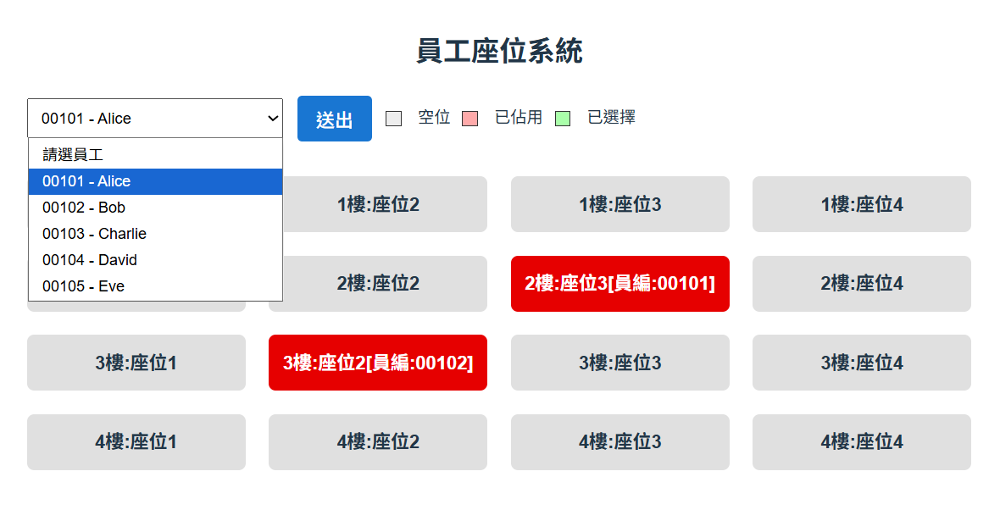

# Seat Management System（座位管理系統）

This project implements a **seat management system** using **Vue.js + Spring Boot + MySQL**.

本專案實作**公司座位管理系統**，可以查看各樓層座位並調整員工座位。

---

# System Architecture（系統架構）

Frontend：Vue.js
Backend：Spring Boot REST API
Database：MySQL (Stored Procedure)

```
Vue → REST API → Spring Boot → Stored Procedure → MySQL
```

---

# Project Structure（專案結構）

```
seat-system
│
├─ DB
│   ├─ 01_ddl.sql
│   ├─ 02_dml.sql
│   └─ 03_sp.sql
│
├─ backend
│   └─ Spring Boot backend service
│
├─ frontend
│   └─ Vue.js frontend
│
└─ README.md
```

---

# Database Setup（資料庫設定）

先建立資料庫

```sql
CREATE DATABASE seating_db;
USE seating_db;
```

依序執行以下 SQL

```
DB/01_ddl.sql
DB/02_dml.sql
DB/03_sp.sql
```

資料表

Employee（員工資料）

SeatingChart（座位表）

---

# Backend Setup（後端啟動）

進入 backend 目錄

```
cd backend
```

啟動 Spring Boot

```
mvn spring-boot:run
```

後端 API

```
http://localhost:8080
```

---

# Frontend Setup（前端啟動）

進入 frontend

```
cd frontend
npm install
npm run dev
```

前端網址

```
http://localhost:5173
```

---

# API Endpoints（API 說明）

## Get employees（取得員工列表）

```
GET /api/employees
```

取得員工清單，用於下拉選單。

---

## Get seats（取得座位表）

```
GET /api/seats
```

取得所有座位與目前佔用員工。

---

## Assign seat（指派座位）

```
POST /api/seat/assign
```

Request Body

```
{
  "empId": "00001",
  "floorSeatSeq": 5
}
```

規則

* 每位員工只能有一個座位
* 若座位已有員工，會先清除原本員工
* 操作使用 Transaction 確保資料一致性

---

## Clear seat（清除座位）

```
POST /api/seat/clear
```

Request Body

```
{
  "floorSeatSeq": 5
}
```

清除該座位的員工，使座位變成空位。

---

# Security（資安設計）

## SQL Injection Prevention

* 所有資料庫操作透過 **Stored Procedure**
* 使用 JDBC 參數綁定避免 SQL Injection

## XSS Prevention

* 後端輸入資料驗證
* Vue 使用安全模板渲染（避免 v-html）

---

# Demo Flow（操作流程）

1. 選擇員工
2. 點擊空座位選擇
3. 點擊已佔用座位可清除
4. 按 Submit 送出
5. 座位表更新

---

# Technologies Used（使用技術）

Backend

* Spring Boot
* Maven
* JDBC
* MySQL

Frontend

* Vue.js
* Vite
* Fetch API
